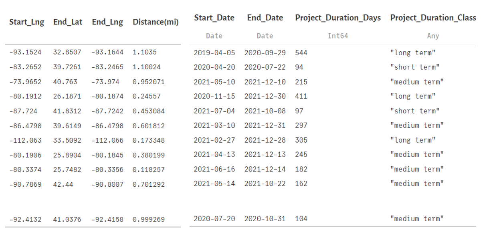
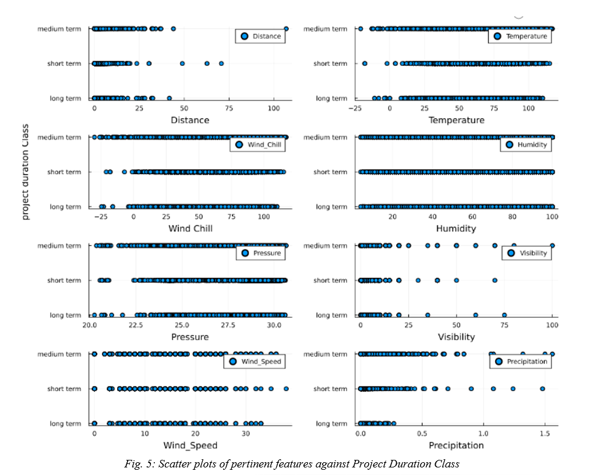
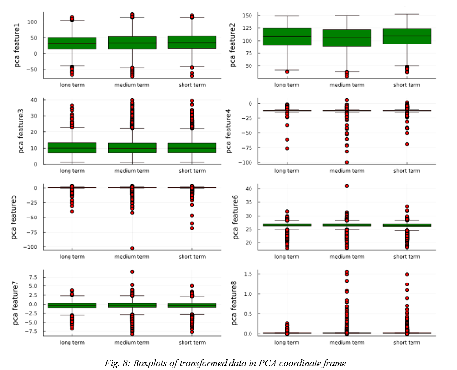
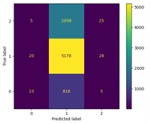
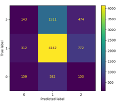
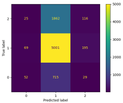

## {.page_break_before}

**__1.0 Introduction__**

A nationwide dataset of road construction and closure events, including data from 49 US states is chosen for the project. The projects included in this dataset's ranges from minor paving repairs to significant undertakings that might take months to complete. Several APIs that provide streaming traffic incident (or event) data were used to collect the data between January 2016 and December 2021. These APIs transmit traffic information gathered by several organizations, including the US and state departments of transportation, law enforcement organizations, traffic cameras, and traffic sensors embedded in the road networks. The number of construction and shutdown records in this dataset currently stands at roughly 6.2 million.

In general, this dataset can be used for a wide range of applications, including the prediction of short- and long-term road construction, the prediction of road closures, the study of the life cycle of road construction, the development of insights to help city planners choose construction sites wisely with the most negligible negative impact on traffic flow, and the investigation of the influence of precipitation or other environmental stimuli on the need for road work. The dataset is being updated on an annual basis. The data is obtained from US Road Construction and Closures(2016 - 2021),from Kaggle, and it is available in CSV format. Presently, the dataset contains 6,170,627 observations comprising of features like Construction severity, Latitude and longitude, Precipitation, Traffic signal and many such, making a total of 47 columns. Table 1 elaborates the specifics of this data set. Using this dataset, a machine learning model will be developed to predict the duration of a new road construction project as short, medium, or long term, given inputs of pertinent features derived from Table 1. The developed model will be cross validated in four(4) folds, to be made suitable for accurate and robust predictions. With this model, it is envisaged that contractors, city planners and relevant authorities can categorize potential road construction projects based on expected average weather conditions, for better planning and project delivery.

To achieve this goal, data wrangling will be performed. The essential data frames for the study will be extracted from the original dataset followed by Exploratory Data Analysis(EDA). EDA will enable us to derive insights by forming a pattern for better visualization and exploration.  Based on this, pertinent features will be realized to build a classification model that accurately predicts the duration of a road construction project(short,medium or long term).

[Table 1: Description of dataset]{.semibold}

|[Features]{.center}|[Description]{.center}|
|:------------|:-------------------------------------|
|ID|Unique identifier of construction record|
|Severity|Shows the severity of the construction|
|Start and End Time|Shows the start time of construction|
|End Time|Shows the end time of construction|
|Latitude and Longitude|Shows the GPS coordinates|
|Distance|The length of the road extent affected by the construction|
|Street Details|Shows the street number, name and right/left side in address field|
|Address Details|Shows the city, county, state, country and zip code in address field|
|Time zone|Shows time zone based on the location of the construction event|
|Weather|Shows the time stamp of weather observation record|
|Temperature, Wind, Humidity, and Pressure|Shows the temperature, wind chill, humidity, and pressure|
|Visibility|Shows visibility|
|Wind Direction and Speed|Shows wind conditions|
|Precipitation and Weather condition|Shows precipitation and weather condition|
|Amenity|An annotation which indicates presence of amenity in a nearby location|
|Bump and Crossing|Annotations which indicate presence of speed bump or hump and crossings|
|Give way, Junction, railway|Annotations which indicate presence of give way, junction and railway|
|Exit, Roundabout, Station, Stop|Annotation which indicates presence of no exit, railway, roundabout, and station|
|Traffic Details|Annotations which indicate traffic calming, signal, turning loop|
|Light Details|Annotations which indicate sunrise, sunset, civil twilight, nautical twilight, astronomical twilight|

**__2.0 Data Wrangling and Exploratory Data Analysis__**

The data obtained from Kaggle is highly generic and unstructured, which is unsuited for analysis in its raw form. To achieve the goals of our design, an initial data wrangling was performed to put the data in the right format followed by Exploratory Data Analysis (EDA) to determine pertinent features that affect road construction duration in USA.

[2.1 Data Cleaning]{.semibold}

The csv file obtained from Kaggle was composed of over 6.1 million observations, which would have been computationally expensive to work with. To reduce the burden of computational time, while still retaining a good representation of the data, 1,048,575 observations (15% original data) were randomly selected with R. The data was converted to a data frame format suitable for analysis with Julia. However, some features were discovered with missing entries, which would be adversarial to subsequent codes and functions. To resolve this problem, a package in Julia (missing package) was leveraged to filter out all observations with one or more missing entries. This process further reduced the size of the dataset to 482,849. Then, an intuitive search was made of pertinent features that could affect road construction duration, like the length of the road extent affected by the construction (denoted by “Distance” in miles), the total amount of precipitation, and other weather parameters. Although some of these pertinent features were discovered, most of the entries of each observation of these features were not in the format suitable for visualization (which requires real numbers) i.e., some variables were strings, or boolean values, hence there was the need to clean this data. Table 2 below shows a segment of the dataset after it has been roughly sampled, and missing entries removed, while Table 3 shows the summary of the dataset.

[Table 2: Dataset of road construction projects in USA]{.semibold} 

[Table 3: A summary of pertinent information of road construction projects in USA]{.semibold}

[2.2 Wrangling and feature derivation]{.semibold} 

It can be seen from Table 2 that the project duration is not explicitly stated. Hence, the project duration was defined to be the difference between the start and end time, after preprocessing the string data entries to a date format. Table 4 shows the resulting features after preprocessing.
 

[Table 4: Derivation of project duration from raw data]{.semibold}

Having computed the project durations as shown in Table 4, some anomalies were detected in the data. The 2^nd^ and 3^rd^ observations show that about 0.43mi and 0.19mi (692m and 305m) of road span were constructed in 1 day, respectively, whereas about 0.03mi (or 48m) was constructed in 8 days as shown in the 4^th^ entry which is unrealistic. To resolve this, a further investigation was done on the narrative of the dataset from Kaggle, and it was deduced that some of the observations were just minor repair works on existing roads (which would not take a long time irrespective of the road span) while others were new construction projects which takes longer to complete. Unfortunately, there exist no feature in the dataset that reveals if an observation was a minor repair task or a major construction task. To circumvent this, observations corresponding to project durations less than 50 days were filtered out, resulting in a dataset of 43,134 observations significantly dominated by new road construction projects or at least projects lasting longer than 50 days. Furthermore, three(3) categories of projects durations were designated as short-, medium- and long-term new road construction projects. A short-term new road construction project is defined as one lasting less than 100 days, while a medium-term project lasts between 100-300 days, and a long-term project lasts longer the 300 days. Table 5 shows the resulting data after grouping into the specified classes.

[Table 5: Dataset for new road construction projects in US, or projects exceeding 50 days of duration]{.semibold}

[2.2.1 Feature detection and EDA]{.semibold} 

The resulting dataset, as presented in Table 5, was processed to reveal key features. A rough guess was made that the numeric features quantifying weather conditions like temperature, humidity, precipitation, wind speed, and pressure together with the road construction span or “Distance” affects the project duration. It was further assumed that the average amount of these quantities (e.g., Temperature) was recorded during the entire project duration, as this information was not explicitly stated in the dataset description. Thus, given the expected or average weather conditions, and the span or extent of the road construction, the developed model is expected to predict the class of the completion time of the project as short, medium or long-term. Table 6 shows the summary of the initial features selected for the development of the model.

[Table 6: Extracted features for EDA]{.semibold} 

An indispensable aspect of EDA is to detect multicollinearity and prevent confounding in the modeling. Julia’s “Statistics” package was leveraged to compute and plot the correlation between all the independent(selected features) and the dependent(project duration) variable. This plot not only enabled the discovery of statistically related features, but also enabled the realization of features that are pertinent to predicting the dependent variable. The figures below show the correlation plots for the selected features.

The “Combinatorics” package in Julia was leveraged to create three(3) combinations of all features plus the dependent variable in order to generate the correlation plots that enabled the determination of the most relevant statistical features. A total of 56 combinations were generated and plotted in Julia, but due to space constraint, only some of the plots are presented in the figures above. The code snippet below illustrates how the figures above were generated.

It can be deduced from Fig. 1 that a strong correlation exists between Temperature and Wind chill, hence Temperature was retained for the model development, while Wind chill was eliminated by choice and convenience. Following the correlation plots above, the scatter plots in Fig. 5, show promise in the development of classification tree networks.

Fig. 5 revealed Humidity as a less promising feature for the project task because a clear cut would be difficult to achieve to develop classification trees. The following box plots in Fig. 6 reveals outliers in all the feature space except for Humidity. This information would guide the selection of locations for cuts in creating decision trees. A further investigation of the statistical significance of the selected features would be done through Principal Component Analysis(PCA). PCA will reveal the directions with most significant variance and enable the dimensional reduction of the model.

[2.3 Dimensionality reduction]{.semibold}

To further explore the possibility of getting a concise representation of the dataset, and improve the model accuracy, PCA was done to transform the data and reduce the size of the feature space. This analysis revealed that with just two principal components, over 97% of the variance in the original dataset could be captured, which is a good representation of the original data and dramatically reduces the number of features to two in the PCA coordinate system. Code snippet 3 below shows the code and results obtained from the PCA analysis.
 

[Table 7: Fraction of Variance]{.semibold} 

Indeed, the PCA shows promise of reducing the feature space, as scatter plots corresponding to all PCA coordinate frames shows the potential of developing a classification tree to meet the goals of this project. As with the original feature space, and outlier analysis was done to detect outliers in the PCA coordinate frames. This post process would yield better accuracy in the model development.

Although one could imagine that the first 2 principal components (that account for over 97% of the variance in the data) would be sufficient for the classification task, this is not the case. The plots in Fig.7 reveal that the 4^th^, 5^th^, 6^th^, 7^th^, and 8^th^ PCA coordinate frames also offer significant promise for the project goal. Additionally, the boxplots created for outlier detection will further guide in the decision tree creation.  It can be seen from the plots in Fig. 7 and 8, that cuts can be made readily made to develop robust decision trees based on the [Gini-impurity algorithm](https://www.learndatasci.com/glossary/gini-impurity/).

**__3.0. Preliminary Modeling__**

[3.1 Data Set for Predictive Modeling]{.semibold}
 
 
Based on the exploratory analysis performed on the selected data set, a predictive model is built on eight potential weather features to predict the duration of road construction in terms of “short term”, “medium term”, or “long-term” project. This feature includes temperature, wind chill, humidity, pressure, visibility, wind speed, precipitation, and distance.
 

To initiate the predictive modeling, the wrangled dataset comprising pertinent features was randomly split into training set, testing set, and validation set having 60%, 20%, and 20% of observations respectively. To ensure the efficiency of predictive modeling, three kinds of datasets from the wrangled data were considered. The first dataset (case 1) was derived by defining the project duration as “short term” if the project duration is less than 100 days, “medium term” if the project duration is in between 100 through 300 days and “long term” if the project duration is greater than 300 days. The second dataset (case 2) is the PCA transformation of the first dataset’s features. Lastly, the third dataset (case 3) defines a “short term” project as one with project duration less than 120 days, “medium term” if the project duration is in between 120 through 200 days and “long term” if the project duration is greater than 200 days. The third dataset innovation was explored because initial results of the first dataset were not very satisfactory, and the determination of that thresholds is quite ambiguous.

 
[3.2 Methodology]{.semibold}

For the model development a deep neural network (DNN) architecture – the sequential model from Keras library in Tensorflow was leveraged [@{https://keras.io/guides/sequential_model/}]. DNN was resorted due to the high dimensionality of the feature- space and the non-existence of a physical model that relates weather conditions to road construction project duration. Hence with DNN, patterns in the data feature-space would be automatically realised, weights would be generated to fit a model to the data and predict the output (project duration labels) given inputs of weather conditions (Temperature, Pressure, etc.). This sequential model accepts a single tensor of features and observations and returns a single tensor of labels for each observation as its output.  Furthermore, the Keras library offers various loss functions depending on the kind of model to be built. For this project, the categorical cross-entropy loss function [@{https://gombru.github.io/2018/05/23/cross_entropy_loss/}] was leveraged for multi-class classification. Python offers great flexibility and computational speed when it comes to addressing multiclass classification problems, hence it was adopted for model development.

As inputs, Temperature, Wind chill, Humidity, Pressure, Visibility, Wind speed, Precipitation, and Distance are the features used to train the model, the input size is eight. The labels from the dataset (i.e., the dependent variable which is the project duration class) is represented in the one-hot [@{https://analyticsindiamag.com/when-to-use-one-hot-encoding-in-deep-learning/}] format. To get the intended predictions, three hidden layers with five neurons each were initially defined. However, the final architecture included seven hidden layers as the initial three hidden layers resulted in 65% training accuracy, which was considered suboptimal. Therefore, in addition to input, and hidden layers, parameters like learning rate – the “Adams learning rate” [@{https://keras.io/guides/sequential_model/}] – a regularization factor that varied from 1e-3 to 1e-6, an epoch (number of steps of gradient descent) of 500, and a batch size of 10, were defined to complete the process of building and training the neural network. These parameters were chosen based on recommendations by [@{https://www.youtube.com/watch?v=2WdPdE2hq78}].

Additionally, the activation function between hidden layers was set to ReLU [@{https://machinelearningmastery.com/rectified-linear-activation-function-for-deep-learning-neural-networks/}], since the input data were mainly numerical data that is continuous in space. However, the sigmoid [@{https://machinelearningmastery.com/a-gentle-introduction-to-sigmoid-function/}] activation function was used between the last hidden layer and the output, because the output is categorical i.e., “short term”, “medium term” and “long term”. This sigmoid function computes the probability of occurrence of each label per observation, that ranges from 0 through 1. The predicted label from various observations is the one which has maximum output probability and is assigned as 1, keeping other labels as 0. To enhance global optimality, stochastic gradient descent “sgd” [@{https://towardsdatascience.com/stochastic-gradient-descent-clearly-explained-53d239905d31}] was also tried as the learning rate function in the model development.

[3.3 Results]{.semibold}

 
Having completed the model preparation and training, the open-source Sklearn [@{https://scikit-learn.org/stable/modules/generated/sklearn.metrics.confusion_matrix.html}] package was leveraged to calculate prediction metrics like precision, recall, and f-score for each class, on the test dataset and also plot confusion matrix for visualization. The confusion matrix plots and accuracy metrics after testing the models on the various test and validation datasets are presented below.

[_Fig 1. Confusion matrix for case 1 test dataset with 3 hidden layers of 32, 64, and 128 neurons respectively_]{.center}

__Outcome:__ 65% accuracy was obtained on the training data, with a loss of about 0.6. The accuracy on the training dataset was suboptimal and hence, no testing was performed on this dataset.

[_Fig 2. Confusion matrix for case 1 test dataset with 7 hidden layers of 32, 64, 128, 256, 128, 64 and 32 neurons respectively_]{.center}

__Outcome:__ 87% accuracy was obtained on the training data, with a loss of about 0.3

|Prediction Matrix|Description|
|:----------------------|:-------------------------------------|
|Precision|0.35, 0.66, and 0.26 for short term, medium term and long term respectively|
|Recall|0.22, 0.72, 0.19, for short term, medium term and long term respectively|
|Proportion of each class in original dataset|25%, 65% and 0.1% for short term, medium term and long term respectively|

[_Fig 3. Confusion matrix for case 2 test dataset, with 7 hidden layers with 32, 64, 128, 256, 128, 64 and 32 neurons respectively_]{.center}

__Outcome:__ 68% accuracy was obtained on the training data, with a loss of about 0.7

|Prediction Matrix|Description|
|:----------------------|:-------------------------------------|
|Precision|0.34, 0.66, and 0.36 for short term, medium term and long term respectively|
|Recall|0.06, 0.95, 0.06, for short term, medium term and long term respectively|
|Proportion of each class in original dataset|25%, 65% and 0.1% for short term, medium term and long term respectively|

[_Fig 4. Confusion matrix for case 2 validation dataset, with 7 hidden layers with 32, 64, 128, 256, 128, 64 and 32 neurons respectively_]{.center} 

__Outcome:__ 68% accuracy was obtained on the training data, with a loss of about 0.7

|Prediction Matrix|Description|
|:----------------------|:-------------------------------------|
|Precision|0.52, 0.67, and 0.58 for short term, medium term and long term respectively|
|Recall|0.08, 0.96, 0.11, for short term, medium term and long term respectively|
|Proportion of each class in original dataset|25%, 65% and 0.1% for short term, medium term and long term respectively|

[_Fig 5. Confusion matrix for case 3 test dataset with 3 hidden layers of 32, 64, and 128 neurons respectively_]{.center}

__Outcome:__ 65% accuracy was obtained on the training data, with a loss of about 0.9.The accuracy on the training dataset was suboptimal and hence, no testing was performed on this dataset

[_Fig 6. Confusion matrix for case 3 test dataset  with 7 hidden layers of 32, 64, 128, 256, 128, 64 and 32 neurons respectively_]{.center}

__Outcome:__ 78% accuracy was obtained on the training data, with a loss of about 0.5

|Prediction Matrix|Description|
|:----------------------|:-------------------------------------|
|Precision|0.41, 0.30, and 0.45 for short term, medium term and long term respectively|
|Recall|0.34, 0.29, 0.52, for short term, medium term and long term respectively|
|Proportion of each class in original dataset|3%, 27% and 40% for short term, medium term and long term respectively|

[3.4 Discussion and Inferences]{.semibold}

The model development could have resulted in a better output if the data was collected keeping the projects’ objective in mind. During the data wrangling stage, some observations were unrealistic as they had a very short duration for relatively long-span projects. Despite filtering and cleaning, the assumptions evoked could not sufficiently produce the near ideal dataset intended. Even with this challenge, the developed model performs quite well in some test cases as seen in section 3.3.

It was observed that the model’s accuracy on the training data set increases with a denser neural network, and for very ambitious trials, an accuracy of about 90% was obtained on training data, even though performance on testing data was far less than 60%. This phenomenon was attributed to the possible overfitting of the training data. Therefore, such models were eschewed, and regularization enabled better generalizability of the developed models.

The developed models have also been cross validated on some portions of the original dataset. For the next steps, the authors propose to explore other techniques for improving the model to enhance generalizability. Since there is no consensus threshold that classifies project durations into the three labels chosen in this work, the authors believe that case 3 is most realistic, since it gives an almost equal chance for classifying a given observation into the derived classes as seen from the confusion matrix plot in section 3.3. However, the difficulties currently encountered in establishing appropriate thresholds to categorize observations as "short-term," "medium-term," or "long-term" could present a potential research opportunity, one of figuring out which threshold produces the best/optimal classification results on cross validation. This can be seen as a problem of parameter identification or inverse analysis to determine suitable thresholds for classifying duration of road construction projects as “short term”, “medium term” or “long term”, based on which of the trail thresholds yields the best predictive model.

Finally, the key lesson learnt is that the developed model is as good as the data, therefore experiments for scientific research must be planned in a way that effectively collects data concerning the project's stated hypothesis.

[References:]{.semibold}

[1] Karimi Monsefi, Amin, Sobhan Moosavi, and Rajiv Ramnath. “Will there be a construction? Predicting road constructions based on heterogeneous spatiotemporal data.”, _2022_

[2] Y. J. Kim, S. Choi, S. Briceno and D. Mavris, "A deep learning approach to flight delay prediction," _2016 IEEE/AIAA 35th Digital Avionics Systems Conference (DASC), 2016, pp. doi:10.1109/DASC.2016.7778092_

