---
title: Predictive Modeling of Effect of Weather Conditions on Road Construction Projects in USA
keywords:
- markdown
- publishing
- manubot
lang: en-US
date-meta: '2022-12-02'
author-meta:
- Amirthavarshini Muraleetharan
- Thomas Ngare
- Kapil Shah
header-includes: |-
  <!--
  Manubot generated metadata rendered from header-includes-template.html.
  Suggest improvements at https://github.com/manubot/manubot/blob/main/manubot/process/header-includes-template.html
  -->
  <meta name="dc.format" content="text/html" />
  <meta name="dc.title" content="Predictive Modeling of Effect of Weather Conditions on Road Construction Projects in USA" />
  <meta name="citation_title" content="Predictive Modeling of Effect of Weather Conditions on Road Construction Projects in USA" />
  <meta property="og:title" content="Predictive Modeling of Effect of Weather Conditions on Road Construction Projects in USA" />
  <meta property="twitter:title" content="Predictive Modeling of Effect of Weather Conditions on Road Construction Projects in USA" />
  <meta name="dc.date" content="2022-12-02" />
  <meta name="citation_publication_date" content="2022-12-02" />
  <meta name="dc.language" content="en-US" />
  <meta name="citation_language" content="en-US" />
  <meta name="dc.relation.ispartof" content="Manubot" />
  <meta name="dc.publisher" content="Manubot" />
  <meta name="citation_journal_title" content="Manubot" />
  <meta name="citation_technical_report_institution" content="Manubot" />
  <meta name="citation_author" content="Amirthavarshini Muraleetharan" />
  <meta name="citation_author_institution" content="Department of CEE, University of Illinois Urbana Champaign" />
  <meta name="citation_author_orcid" content="677-010-487" />
  <meta name="citation_author" content="Thomas Ngare" />
  <meta name="citation_author_institution" content="Department of CEE, University of Illinois Urbana Champaign" />
  <meta name="citation_author_orcid" content="652-601-317" />
  <meta name="citation_author" content="Kapil Shah" />
  <meta name="citation_author_institution" content="Department of CEE, University of Illinois Urbana Champaign" />
  <meta name="citation_author_orcid" content="668-376-620" />
  <link rel="canonical" href="https://uiceds.github.io/cee-492-term-project-fall-2022-jakt/" />
  <meta property="og:url" content="https://uiceds.github.io/cee-492-term-project-fall-2022-jakt/" />
  <meta property="twitter:url" content="https://uiceds.github.io/cee-492-term-project-fall-2022-jakt/" />
  <meta name="citation_fulltext_html_url" content="https://uiceds.github.io/cee-492-term-project-fall-2022-jakt/" />
  <meta name="citation_pdf_url" content="https://uiceds.github.io/cee-492-term-project-fall-2022-jakt/manuscript.pdf" />
  <link rel="alternate" type="application/pdf" href="https://uiceds.github.io/cee-492-term-project-fall-2022-jakt/manuscript.pdf" />
  <link rel="alternate" type="text/html" href="https://uiceds.github.io/cee-492-term-project-fall-2022-jakt/v/6577f1f100f5d4ab5aff3370d64ac33b959ee5bf/" />
  <meta name="manubot_html_url_versioned" content="https://uiceds.github.io/cee-492-term-project-fall-2022-jakt/v/6577f1f100f5d4ab5aff3370d64ac33b959ee5bf/" />
  <meta name="manubot_pdf_url_versioned" content="https://uiceds.github.io/cee-492-term-project-fall-2022-jakt/v/6577f1f100f5d4ab5aff3370d64ac33b959ee5bf/manuscript.pdf" />
  <meta property="og:type" content="article" />
  <meta property="twitter:card" content="summary_large_image" />
  <link rel="icon" type="image/png" sizes="192x192" href="https://manubot.org/favicon-192x192.png" />
  <link rel="mask-icon" href="https://manubot.org/safari-pinned-tab.svg" color="#ad1457" />
  <meta name="theme-color" content="#ad1457" />
  <!-- end Manubot generated metadata -->
bibliography:
- content/manual-references.json
manubot-output-bibliography: output/references.json
manubot-output-citekeys: output/citations.tsv
manubot-requests-cache-path: ci/cache/requests-cache
manubot-clear-requests-cache: false
...

<small><em>
This manuscript
([permalink](https://uiceds.github.io/cee-492-term-project-fall-2022-jakt/v/6577f1f100f5d4ab5aff3370d64ac33b959ee5bf/))
was automatically generated
from [uiceds/cee-492-term-project-fall-2022-jakt@6577f1f](https://github.com/uiceds/cee-492-term-project-fall-2022-jakt/tree/6577f1f100f5d4ab5aff3370d64ac33b959ee5bf)
on December 2, 2022.
</em></small>

## Authors

+ **Amirthavarshini Muraleetharan** 
    {.inline_icon}
    [677-010-487](https://orcid.org/677-010-487)
    · {.inline_icon}
    [amirthavarshini246](https://github.com/amirthavarshini246) 
  <small>
     Department of CEE, University of Illinois Urbana Champaign
  </small>

+ **Thomas Ngare** 
    {.inline_icon}
    [652-601-317](https://orcid.org/652-601-317)
    · {.inline_icon}
    [thomasNg](https://github.com/thomasNg) 
  <small>
     Department of CEE, University of Illinois Urbana Champaign
  </small>

+ **Kapil Shah** 
    {.inline_icon}
    [668-376-620](https://orcid.org/668-376-620)
    · {.inline_icon}
    [kapilrs2](https://github.com/kapilrs2) 
  <small>
     Department of CEE, University of Illinois Urbana Champaign
  </small>

## {.page_break_before}

**__Abstract__**

Although sophisticated tools exist for predicting future weather conditions, how these measurements combine to systematically affect project duration is quite intractable. To tackle complex predictive modeling problems, Artificial Intelligence (AI) and Deep Neural Networks (DNN) have been applied over the years to develop sophisticated predictive models from measured data. AI and DNN leverage the classical concepts of regression, back-propagation, and optimization to fit a mathematical model to data. For a successful model to be realized via AI and DNN approaches, some knowledge of the parameters that affect the variable to be predicted is required. The exact mathematical or physical relationship between weather conditions and project duration is unknown in this study. The weather parameters that could affect project duration are studied via Exploratory Data Analysis (EDA), and the length of the road construction is explored as a pertinent feature too. The results of EDA enabled the development of a DNN model for predicting project durations as short-, medium-, or long-term. Furthermore, the authors discovered an almost equal chance of classifying projects into the above-listed categories leveraging the discovered features from EDA. This result is attributed to the ill-definition of project duration classes, the uncertainties in the data acquisition process, and the representation of the dataset obtained from Kaggle’s website.

**__1.0 Introduction__**

A nationwide dataset of road construction and closure events, including data from 49 US states is chosen for the project. The projects included in this dataset's ranges from minor paving repairs to significant undertakings that might take months to complete. Several APIs that provide streaming traffic incident (or event) data were used to collect the data between January 2016 and December 2021. These APIs transmit traffic information gathered by several organizations, including the US and state departments of transportation, law enforcement organizations, traffic cameras, and traffic sensors embedded in the road networks. The number of construction and shutdown records in this dataset currently stands at roughly 6.2 million.

Intuitively, one would imagine that harsh weather conditions would affect the duration of a road construction project. Moreover, project durations could be quantitatively classified as short-, medium-, or long-term based on suitable thresholds that map project duration (in days) to the underlisted classes. Although sophisticated tools exist for predicting future weather conditions, how these measurements combine to systematically affect project duration is quite intractable. To tackle complex predictive modeling problems, Artificial intelligence (AI) [1] and Deep Neural Networks (DNN) [2] have been leveraged over the years to develop sophisticated predictive models from measured data. AI and DNN leverage the classical concepts of regression [3], back-propagation [4], and optimization [5] to fit a mathematical model to data. For a successful model to be realized via AI and DNN approaches, some knowledge of the parameters that affect the variable to be predicted is required. The exact mathematical/physical relationship between weather conditions and project duration is unknown in this study. Therefore, the weather parameters that could affect project duration are studied via exploratory data analysis (EDA) [6], and the length of the road construction is explored as a pertinent feature. The results of EDA enabled the development of a DNN model for predicting project durations as short-, medium-, or long-term.

For this study, a nationwide dataset of road construction and closure events, including data from 49 US states, is chosen for the project. The road work included in this dataset's construction events ranges from minor paving repairs to significant undertakings that might take months to complete. Several APIs that provide streaming traffic incident (or event) data are used to collect the data between January 2016 and December 2021. These APIs transmit traffic information gathered by several organizations, including the US and state departments of transportation, law enforcement organizations, traffic cameras, and traffic sensors embedded in the road networks. The number of construction and shutdown records in this dataset currently stands at roughly 6.2 million. In general, this dataset can be used for a wide range of applications, including the prediction of short- and long-term road construction, the prediction of road closures, the study of the life cycle of road construction, the development of insights to help city planners choose construction sites wisely with the most negligible negative impact on traffic flow, and the investigation of the influence of precipitation or other environmental stimuli on the need for road work [7]. The dataset is being updated on an annual basis. The data will be obtained from Kaggle [8], which is available in CSV format. Presently, the dataset contains 6,170,627 observations comprising features like Construction severity, Latitude, longitude, Precipitation, Traffic signal, etc., resulting in a total of 47 columns. Table 1 elaborates on the description of this data set.

This dataset is used to develop a DNN model to predict the duration of a new road construction project as short, medium, or long-term, given inputs of pertinent features derived from Table 1. The developed model is then validated and tested to be made suitable for accurate and robust predictions. With this model, it is envisaged that contractors, city planners, and relevant authorities can categorize potential road construction projects based on expected average weather conditions for better planning and project delivery. 
This study explains how data wrangling is performed to clean, manipulate and make the obtained data suitable for EDA in section 2. Section 3 elaborates on a methodology for developing a DNN to map measurements to predictions, and finally, the study is concluded in section 4 with a discussion of our results and proposal for future study. In the end, an appendix section is included, which comprises relevant tables and plots.

[Table 1: Description of dataset]{.semibold}

|[Features]{.center}|[Description]{.center}|
|:------------|:-------------------------------------|
|ID|Unique identifier of construction record|
|Severity|Shows the severity of the construction|
|Start and End Time|Shows the start time of construction|
|End Time|Shows the end time of construction|
|Latitude and Longitude|Shows the GPS coordinates|
|Distance|The length of the road extent affected by the construction|
|Street Details|Shows the street number, name and right/left side in address field|
|Address Details|Shows the city, county, state, country and zip code in address field|
|Time zone|Shows time zone based on the location of the construction event|
|Weather|Shows the time stamp of weather observation record|
|Temperature, Wind, Humidity, and Pressure|Shows the temperature, wind chill, humidity, and pressure|
|Visibility|Shows visibility|
|Wind Direction and Speed|Shows wind conditions|
|Precipitation and Weather condition|Shows precipitation and weather condition|
|Amenity|An annotation which indicates presence of amenity in a nearby location|
|Bump and Crossing|Annotations which indicate presence of speed bump or hump and crossings|
|Give way, Junction, railway|Annotations which indicate presence of give way, junction and railway|
|Exit, Roundabout, Station, Stop|Annotation which indicates presence of no exit, railway, roundabout, and station|
|Traffic Details|Annotations which indicate traffic calming, signal, turning loop|
|Light Details|Annotations which indicate sunrise, sunset, civil twilight, nautical twilight, astronomical twilight|

**__2.0 Data Wrangling and Exploratory Data Analysis__**

The data set obtained from Kaggle is highly generic and unstructured, which limits the outcome if used as it is in predictive modeling. To ensure the data is reliable and complete, data wrangling is performed to derive maximum insights from it, making it qualitative data suitable for analysis. EDA was later used to explicitly identify the pertinent features affecting the duration of road construction.

[2.1 Data Cleaning]{.semibold}

The original data set was composed of 6.1 million observations, which is computationally expensive to work with given time constraints. Given the scope of work and time availability, the idea is to reduce the data to a computationally amenable size. Based on the random guess, 15% of the original data is selected for the analysis ignoring the rest, 85% of the data. In addition, the data frame obtained from this data had some missing entries, which were removed, further reducing the size of the data set to 482,849 observations. Also, the selected data frame needed cleaning of any Boolean and Strings values before EDA. Fig. 14 in the appendix shows the summary of the cleaned dataset.

[2.2 Data Wrangling]{.semibold} 

The data to the naked eye was still unsatisfactory as features like project duration were not explicitly mentioned; instead, project start- and end-time were described as two different features. Using Julia’s syntax, a new feature termed “Project Duration Days” is computed by taking the difference between respective project start and end times. Fig. 15 in the appendix shows how this data looked before and after performing data wrangling in specifics to project duration. After obtaining the project duration and reading it in parallel with the road length, some observations did not seem realistically possible. For instance, one of the rows shows that a road length of 1.1035 miles takes more than a year to complete its construction, which is not realistic if analyzed through the lenses of civil engineering. The original data set was further investigated to conclude that the data set also includes road repair work in addition to the new road construction. Unfortunately, the dataset has no feature that reveals if an observation was a minor repair task or a primary construction task. To circumvent this, observations corresponding to project durations less than 50 days are filtered out, resulting in a dataset of 43,134 observations significantly dominated by new road construction projects or at least projects lasting longer than 50 days.
 

The project duration is further categorized into short-, medium- and long-term road construction projects to better suit our predictive modeling. For this project, a short-term road construction project is defined as one lasting less than 100 days, a medium-term project lasts between 100-300 days, and a long-term project lasts longer than 300 days. Fig. 16 in the appendix showcases how the data set looks after applying the classification to the project duration.
 

[2.2.1 Feature Detection and EDA]{.semibold} 

The resulting dataset, as presented in Fig. 16 of the appendix, is processed to reveal critical features. A rough guess is that the features quantifying environmental conditions like temperature, wind chill, pressure, and humidity together with the road construction span affect the project duration as there is a considerable spread in their histogram distributions. It is assumed that the recorded values of these environmental features are an average over the entire project duration. Thus, given the average environmental conditions and the span of road construction, the developed model is expected to predict the class of the project's completion time as short, medium, or long-term. Table 2 below shows the summary of features selected for the predictive model.

[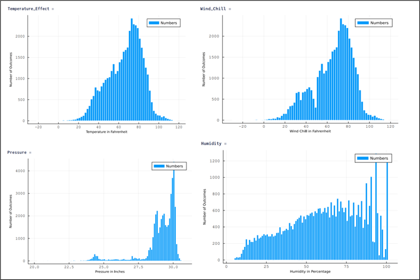]{.center}
[[*Fig. 1: Histogram plots showing spread of Temperature, Wind Chill, Pressure and Humidity in the selected dataset*]{.center}]{.semibold}

[[Table 2: Extracted features for performing EDA]{.center}]{.semibold}
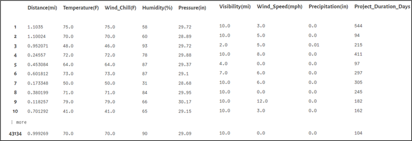{.center}

[2.2.1 Feature detection and EDA]{.semibold} 

The data presented in Table 2 is a dataset that is easier for all the subsequent working. It currently comprises eight independent features, with project duration as the dependent feature. An indispensable aspect of EDA is detecting multicollinearity and preventing modeling confounding. Therefore, Julia’s “Statistics” package is leveraged to compute and plot the correlation between all the independent and the dependent variables. This plot enabled the discovery of statistically related features. The figures (Fig. 2 through Fig. 5) below show the correlation plots for the selected features. The “Combinatorics” package in Julia is leveraged to create three (3) combinations of all features, including the dependent variable. A total of fifty-six (56) combinations were generated and plotted in Julia.

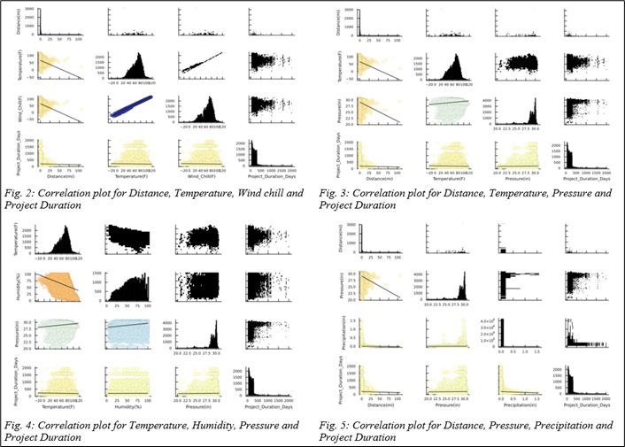{.center}

Following the correlation plots above, the scatter plots, as shown in Fig. 6, are plotted, showing promise in developing a classification tree or neural network.

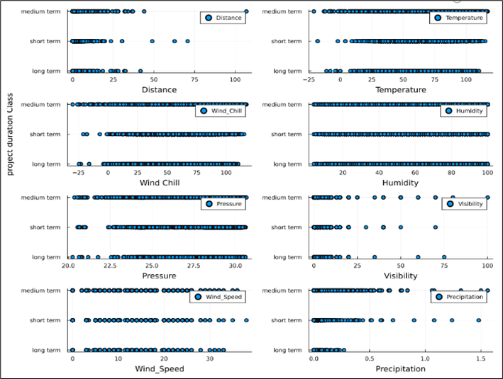{.center}
[[*Fig. 6: Scatter plots of pertinent features against Project Duration Class*]{.center}]{.semibold}

Despite Fig. 6 revealing Humidity as a less promising feature for the project task, all features will be considered in the model development. Additionally, as shown in Fig. 7, the following box plots reveal outliers in all the feature spaces except for Humidity. A further investigation of the statistical significance of selected features is done through Principal Component Analysis (PCA) which enables possible dimensional reduction of the model.

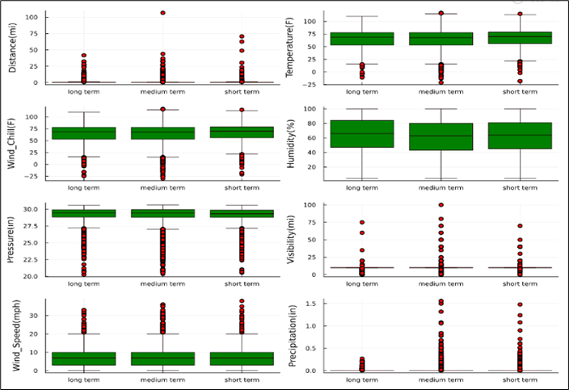{.center}
[[*Fig. 7: Box plots for outlier detection in pertinent features*]{.center}]{.semibold}

[2.3 Dimensionality Reduction]{.semibold}

PCA is performed to get a concise dataset representation, improve the model accuracy, and transform the data set. This analysis captured 97% of the variance in the original dataset with just two principal components, which is a good representation of the original data. Furthermore, it dramatically reduced the number of features to two, hinting at a strong possibility of a classification model.Outlier analysis too is done to identify outliers in the PCA coordinate frames for tuning and feature selection. These scatter plots with the outlier detection analysis are presented in the appendices for better understanding. A quick overview makes one feel that the first two principal components would be sufficient for the classification task. However, this is not the case. The plots in Fig. 17 in the appendix reveal that the 4th, 5th, 6th, 7th, and 8th PCA coordinate frames, too, offer significant promise for the project goal. Fig. 17 and Fig. 18 of the appendix showcase that cuts can be readily made to develop robust decision trees based on the Gini-impurity algorithm [9], or a Deep Neural Network could be easily employed.
 

**__3.0. Model Development and Evaluation__**

[3.1 Datasets for model development]{.semibold}
 

Based on EDA performed on the selected data set, a predictive model is built on seven potential weather features and the road construction length (“Distance” in miles) – making a total of 8 input features – to predict the duration of road construction as “short term”, “medium term”, or “long-term” project. These features include temperature, wind chill, humidity, pressure, visibility, wind speed, precipitation, and distance.
 

To initiate the predictive modeling, the wrangled dataset comprising pertinent features was randomly split into training set, testing set, and validation set having 60%, 20%, and 20% observations respectively. To ensure the efficiency of predictive modeling, three kinds of datasets from the wrangled data were considered. The first dataset (case 1) was derived by defining the project duration as “short-term” if the project duration is less than 100 days, “medium-term” if the project duration is between 100 through 300 days and “long-term” if the project duration is greater than 300 days. The second dataset (case 2) is the PCA transformation of the first dataset’s features. Lastly, the third dataset (case 3) defines a “short-term” project as one with a project duration less than 120 days, “medium-term” if the project duration is between 120 through 200 days, and “long-term” if the project duration is greater than 200 days. The third dataset was explored because the initial results of the first dataset were not very satisfactory, and the determination of these thresholds is quite ambiguous.

 
[3.2 Methodology]{.semibold}

For the model development, a deep neural network (DNN) architecture – the sequential model from the Keras library in Tensorflow was leveraged [10]. DNN was resorted due to the high dimensionality of the feature-space and the non-existence of a physical model that relates weather conditions to road construction project duration. Hence with DNN, patterns in the data feature space would be automatically realized, weights would be generated to fit a model to the data and predict the output (project duration labels) given inputs of weather conditions (Temperature, Pressure, etc.) and road length. This sequential model accepts a single tensor of features and observations and returns a single tensor of labels for each observation as its output. Furthermore, the Keras library offers various loss functions depending on the kind of model to be built. The categorical cross-entropy loss function [11] was leveraged for multi-class classification for this project. Python offers great flexibility and computational speed when addressing multi-class classification problems; hence it was adopted for model development. Additionally, R was leveraged to validate the modeling process with Python, and the results obtained agree with those of Python. The confusion matrix plots obtained from R are attached as Fig. 19 and Fig. 20 in the appendix of this report. The labels from the dataset (i.e., the dependent variable which is the project duration class) is represented in the one-hot [12] format. To get the intended predictions, three hidden layers with 32, 64 and 128 neurons respectively were initially defined. However, the final architecture included seven hidden layers as the initial three hidden layers resulted in only 65% training accuracy, which was considered suboptimal. Also, we tuned parameters like regularization, epoch (number of gradient descent steps, and batch size to enhance the process of building and training the neural network. Regularization was tuned between 1e-3 and 1e-6 for various trials, epoch was tuned to 500, and batch size was tuned to 10. These parameters were chosen based on recommendations by [13].

Additionally, the activation function between hidden layers was set to ReLU [14], since the input data were mainly numerical data that is continuous in space. However, the sigmoid [15] activation function was used between the last hidden layer and the output, because the output is categorical i.e., “short-term”, “medium-term” and “long-term”. This sigmoid function computes the probability of occurrence of each label per observation, that ranges from 0 through 1. The predicted label from various observations is the one that has maximum output probability and is assigned as 1, keeping other labels as 0. To enhance global optimality, stochastic gradient descent “sgd” [16] was also tried as the learning rate function in the model development.

[3.3 Results]{.semibold}

Having completed the model preparation and training, the open-source Sklearn [17] package was leveraged to calculate prediction metrics like precision, recall, and f-score for each class, on the test dataset and plot confusion matrix for visualization. The confusion matrix plots and accuracy metrics after testing the models on the various test and validation datasets are presented below.

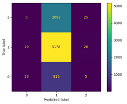{.center}
[[*Fig. 8. Confusion matrix for case 1 test dataset, with 3 hidden layers of 32, 64, and 128 neurons respectively*]{.center}]{.semibold}

__Outcome from Fig. 8:__ 65% accuracy was obtained on the training data, with a loss of about 0.6. The accuracy on the training dataset was suboptimal and hence, no testing was performed on this dataset.

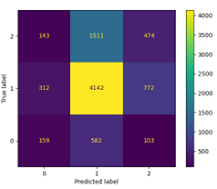{.center}
[[*Fig. 9. Confusion matrix for case 2 test dataset, with 7 hidden layers with 32, 64, 128, 256, 128, 64 and 32 neurons respectively*]{.center}]{.semibold}

__Outcome from Fig. 9:__ 87% accuracy was obtained on the training data

|Prediction Matrix|Description|
|:----------------------|:-------------------------------------|
|Precision|0.35, 0.66, and 0.26 for short term, medium term and long term respectively|
|Recall|0.22, 0.72, 0.19, for short term, medium term and long term respectively|
|Proportion of each class in original dataset|25%, 65% and 0.1% for short term, medium term and long term respectively|

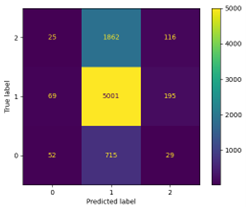{.center}
[[*Fig 10. Confusion matrix for case 2 test dataset, with 7 hidden layers with 32, 64, 128, 256, 128, 64 and 32 neurons respectively*]{.center}]{.semibold}

__Outcome from Fig. 10:__ 68% accuracy was obtained on the training data, with a loss of about 0.7

|Prediction Matrix|Description|
|:----------------------|:-------------------------------------|
|Precision|0.34, 0.66, and 0.36 for short term, medium term and long term respectively|

[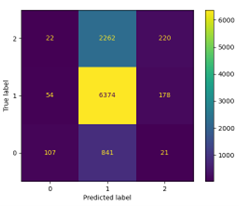{.center}
[*Fig 11. Confusion matrix for case 2 validation dataset, with 7 hidden layers with 32, 64, 128, 256, 128, 64 and 32 neurons respectively*]{.center}]{.semibold} 

__Outcome from Fig. 11:__ 68% accuracy was obtained on the training data, with a loss of about 0.7

|Prediction Matrix|Description|
|:----------------------|:-------------------------------------|
|Precision|0.52, 0.67, and 0.58 for short term, medium term and long term respectively|
|Recall|0.08, 0.96, 0.11, for short term, medium term and long term respectively|
|Proportion of each class in original dataset|25%, 65% and 0.1% for short term, medium term and long term respectively|

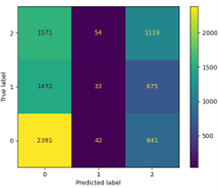{.center}
[[*Fig 12. Confusion matrix for case 3 test dataset with 3 hidden layers of 32, 64, and 128 neurons respectively*]{.center}]{.semibold}

__Outcome from Fig. 12:__ 65% accuracy was obtained on the training data, with a loss of about 0.9.The accuracy on the training dataset was suboptimal and hence, no testing was performed on this dataset

{.center}
[[*Fig 13. Confusion matrix for case 3 test dataset  with 7 hidden layers of 32, 64, 128, 256, 128, 64 and 32 neurons respectively*]{.center}]{.semibold}

__Outcome from Fig. 13:__ 78% accuracy was obtained on the training data, with a loss of about 0.5

|Prediction Matrix|Description|
|:----------------------|:-------------------------------------|
|Precision|0.41, 0.30, and 0.45 for short term, medium term and long term respectively|
|Recall|0.34, 0.29, 0.52, for short term, medium term and long term respectively|
|Proportion of each class in original dataset|3%, 27% and 40% for short term, medium term and long term respectively|

**__4.0. Discussion and Recommendations__**

The model development could have resulted in prediction efficiency if the data was collected keeping the projects’ objective in mind. During the data wrangling stage, some observations were unrealistic as they had a very short duration for relatively long-span projects. Despite wrangling and cleaning, the assumptions evoked could not sufficiently produce the near-ideal dataset intended. Even with this challenge, the developed model performs quite well in some test cases, as seen in section 3.3. The model’s accuracy on the training data set was observed to increase with a denser neural network. For very ambitious trials, an accuracy of about 90% was obtained on training data, even though performance on testing data was far less than 60%. This phenomenon was attributed to the possible overfitting of the training data. Thus, such models were eschewed, and regularization enabled a more accurate assessment of generalizability. The developed models were validated on some portions of the original dataset, and the results are attached in the appendix.

For the following steps, the authors propose to explore other techniques for improving the model to enhance generalizability. Since there is no consensus threshold that classifies project durations into the three labels chosen in this work, the authors believe that case 3 is the most realistic since it gives an almost equal chance for classifying a given observation into the derived classes, as seen from the confusion matrix plot in section 3.3. Additionally, the difficulties currently encountered in establishing appropriate thresholds to categorize observations as “short-term,” “medium-term,” or “long-term” could present a potential research opportunity: one of identifying which threshold produces the best/optimal classification results. This can be seen as a problem of parameter identification or inverse analysis to determine suitable thresholds for classifying the duration of road construction projects as “short-term”, “medium-term”, or “long-term”, based on which of the trail thresholds yields the best predictive model. Finally, the key lesson learned is that the developed model is as good as the data. Therefore, experiments for scientific research must be planned in a way that effectively collects data concerning the project’s stated hypothesis.

[References:]{.semibold}

[1]	Artificial Neural Networks: https://www.sciencedirect.com/topics/earth-and-planetary-sciences/artificial-neural-network

[2]	Deep learning: https://en.wikipedia.org/wiki/Deep_learning

[3]	Understanding regression in Machine Learning: https://builtin.com/data-science/regression-machine-learning

[4]	Back Propagation in Machine Learning: https://www.guru99.com/backpropogation-neural-network.html

[5]	Why optimization is important in Machine Learning: https://machinelearningmastery.com/why-optimization-is-important-in-machine-learning/

[6]	Exploratory Data Analysis: https://en.wikipedia.org/wiki/Exploratory_data_analysis

[7]	Karimi Monsefi, Amin, Sobhan Moosavi, and Rajiv Ramnath. “Will there be construction? Predicting road constructions based on heterogeneous spatiotemporal data.”, 2022: [2209.06813] Will there be a construction? Predicting road constructions based on heterogeneous spatiotemporal data (arxiv.org)

[8]	US Road Construction and Closures (2016 - 2021), Kaggle: US Road Construction and Closures (2016 - 2021) | Kaggle

[9]	Gini-impurity algorithm: Gini Impurity – LearnDataSci

[10]	Keras documentation: The sequential model Keras Team: https://keras.io/guides/sequential_model/

[11]	Understanding Categorical Cross-Entropy Loss, Binary Cross-Entropy Loss, Softmax Loss, Logistic Loss, Focal Loss and all those confusing names https://gombru.github.io/2018/05/23/cross_entropy_loss/

[12]	When to Use One-Hot Encoding in Deep Learning?) https://analyticsindiamag.com/when-to-use-one-hot-encoding-in-deep-learning/

[13]	Constructing a Multi-Class Classifier Using Neural Network with Python (Tensorflow Keras): https://www.youtube.com/watch? v=2WdPdE2hq78

[14]	A Gentle Introduction to the Rectified Linear Unit (ReLU), Jason Brownlee: https://machinelearningmastery.com/rectified-linear-activation-function-for-deep-learning-neural- networks/

[15]	A Gentle Introduction To Sigmoid Function: https://machinelearningmastery.com/a-gentle-introduction-to-sigmoid-function/

[16]	Stochastic Gradient Descent — Clearly Explained !! https://towardsdatascience.com/stochastic-gradient-descent-clearly-explained-53d239905d31

[17]	sklearn.metrics.confusion_matrix: https://scikit-learn/stable/modules/generated/sklearn.metrics.confusion_matrix.html

**__Appendix__**

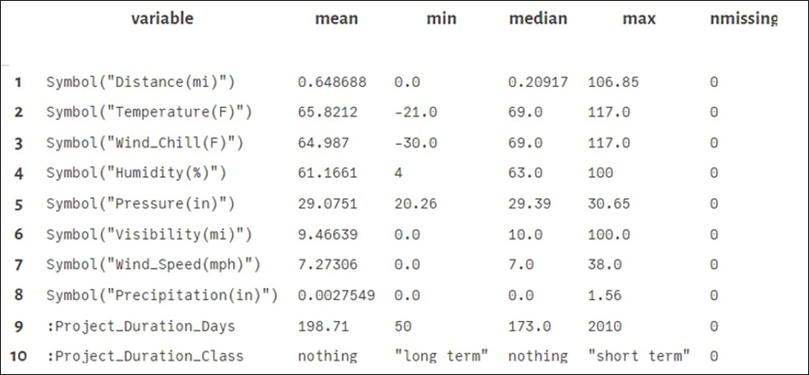{.center}
[[*Fig. 14: Summary of the cleaned dataset*]{.center}]{.semibold}

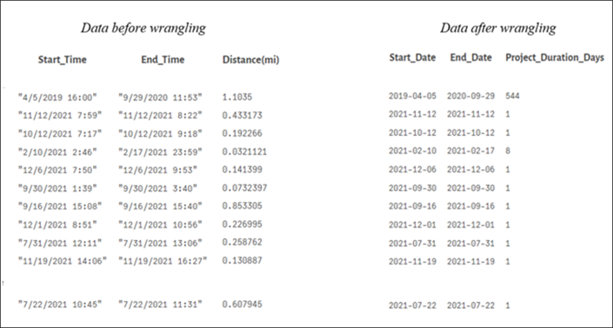{.center}
[[*Fig. 15: Figure showing data set before and after data wrangling*]{.center}]{.semibold}

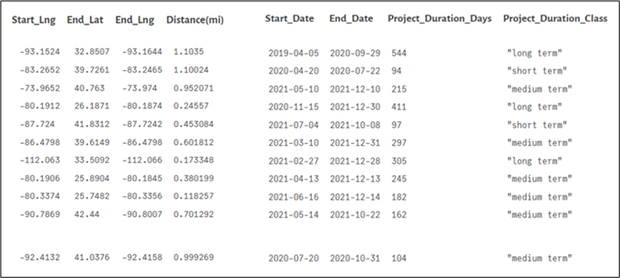{.center}
[[*Fig. 16: Data set after adding project duration classification*]{.center}]{.semibold}

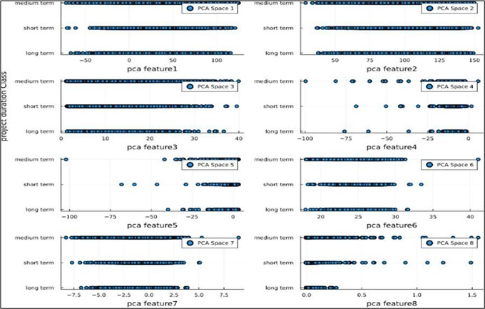{.center}
[[*Fig. 17: Transformed data in PCA coordinate frame*]{.center}]{.semibold}

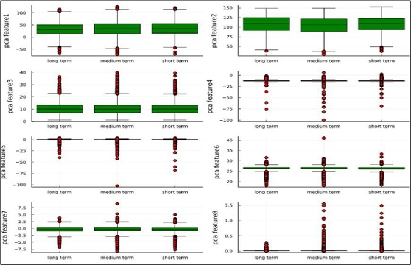{.center}
[[*Fig. 18: Boxplots of transformed data in PCA coordinate frame*]{.center}]{.semibold}

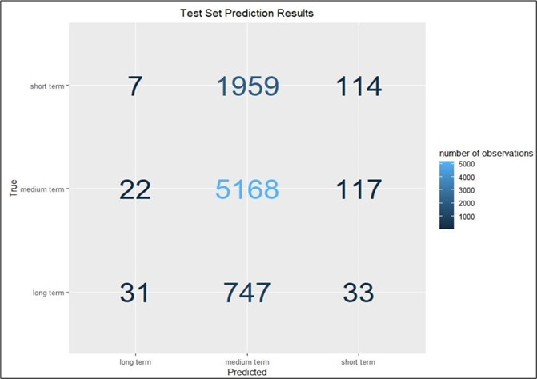{.center}
[[*Fig. 19: Confusion matrix plots from R for case 2 test dataset, with 1  hidden layer of  32 neurons respectively*]{.center}]{.semibold}

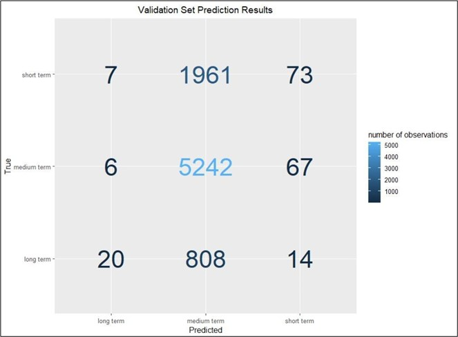{.center}
[[*Fig. 20: Confusion matrix plots from R for case 2 validation dataset with 1 hidden layer of 32 neurons respectively*]{.center}]{.semibold}